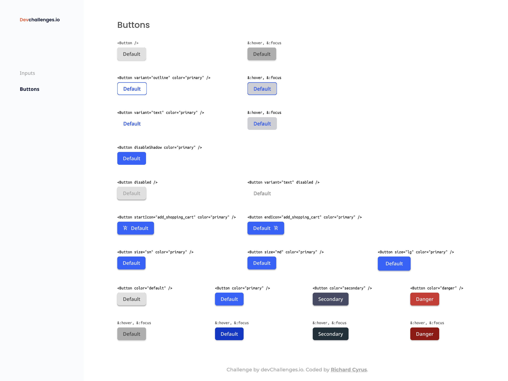

<h1 align="center">devchallenges-button-component</h1>

<div align="center">
   Solution for a challenge from  <a href="http://devchallenges.io" target="_blank">Devchallenges.io</a>.
</div>

<div align="center">
  <h3>
    <a href="https://devchallenges.io/challenges/ohgVTyJCbm5OZyTB2gNY">
      Challenge
    </a>
  </h3>
</div>

<!-- TABLE OF CONTENTS -->

## Table of Contents

- [Overview](#overview)
  - [User Stories](#user-stories)
  - [Built With](#built-with)
- [Features](#features)
- [How to use](#how-to-use)
- [Acknowledgements](#acknowledgements)
- [Contact](#contact)

<!-- OVERVIEW -->

## Overview



Create a reusable button with all the states in the design and a page displaying all the states.

### User Stories

- As a user, I want to create buttons of different types: default, outline and text.
- As a user, I want to be able to disable the shadow on a button.
- As a user, I want to be able to disable the button.
- As a user, I want to choose to have an icon on the left or right.
- As a user, I want to have different button sizes.
- As a user, I want to have different button colors.
- As a user, I want to see a different state when the button is focused or hovered.
- As a user, I want to use any of the standard HTML attributes available for buttons.

### Built With

- Flexbox
- CSS Grid
- [React](https://reactjs.org/)
- [Vite](https://vitejs.dev)
- [Vitest](https://vitest.dev) - A blazing fast unit-test framework powered by Vite.
- [Testing Library](https://testing-library.com) - Simple and complete testing utilities that encourage good testing practices.
- [material-icons](https://github.com/marella/material-icons)
- [Sass Color Generator](http://scg.ar-ch.org)

## Features

This application/site was created as a submission to a [DevChallenges](https://devchallenges.io/challenges) challenge. The [challenge](https://devchallenges.io/challenges/ohgVTyJCbm5OZyTB2gNY) was to create a reusable button with all the states in the design and a page displaying all the states.

## How To Use

To clone and run this application, you'll need [Git](https://git-scm.com) and [Node.js](https://nodejs.org/en/download/) (which comes with [npm](http://npmjs.com)) installed on your computer. From your command line:

```bash
# Clone this repository
$ git clone https://github.com/richardcyrus/devchallenges-button-component

# Install dependencies
$ yarn

# Run the app
$ yarn dev
```

## Acknowledgements

- [My Custom CSS Reset](https://www.joshwcomeau.com/css/custom-css-reset/)
- [A Modern CSS Reset](https://piccalil.li/blog/a-modern-css-reset/)
- [Notes on Josh Comeau’s Custom CSS Reset](https://css-tricks.com/notes-on-josh-comeaus-custom-css-reset/)
- [A Complete Guide to Flexbox](https://css-tricks.com/snippets/css/a-guide-to-flexbox/)
- [A Complete Guide to Grid](https://css-tricks.com/snippets/css/complete-guide-grid/)
- [React TypeScript Cheatsheets](https://react-typescript-cheatsheet.netlify.app/)
- [Testing a Button Component](https://debbie.codes/blog/testing-button-component/)
- [How to Test CSS Modules with Vitest](https://runthatline.com/test-css-module-classes-in-vue-with-vitest/)
- [TESTING A REACT APPLICATION WITH VITEST](https://eternaldev.com/blog/testing-a-react-application-with-vitest/)
- [Vitest with React Testing Library](https://www.robinwieruch.de/vitest-react-testing-library/)
- [CSS3 Tip: Removing Box Shadows](https://perishablepress.com/css3-remove-box-shadow/)
- [:focus-visible](https://developer.mozilla.org/en-US/docs/Web/CSS/:focus-visible)
- [CSS Button Styling Guide](https://moderncss.dev/css-button-styling-guide/)
- [Creating a React Input component in typescript](https://giselamirandadifini.com/creating-a-react-input-component-in-typescript)
- [How to use ESLint with TypeScript](https://khalilstemmler.com/blogs/typescript/eslint-for-typescript/)

## Contact

- Website [www.richardcyrus.com](https://www.richardcyrus.com)
- GitHub [@richardcyrus](https://github.com/richardcyrus)
